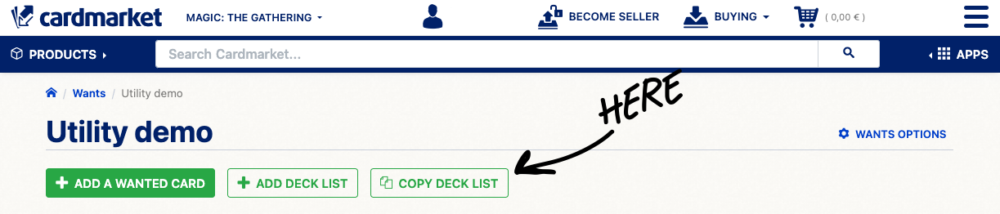

# Cardmarket Utility

Chrome extension (manifest v3) for adding a "Copy Deck List" button to your Wants page.

## How to use


- Clone the repo
    - or download as zip, if that's your thing
- Load unpacked extension ([see Chrome docs](https://developer.chrome.com/docs/extensions/mv3/getstarted/development-basics/#load-unpacked))
- Go to your Wants list on Cardmarket
- Click the button to copy your deck list


## Roadmap / Todo

1. Implement the copy button for Purchases
2. Something

## ...but why an extension?

I shop on Cardmarket once in a while and it's always an annoyance that they don't have easy ways to copy your list of wants or the list of purchases. Hence, this extension was created.

I previously had a couple bookmarklets that did the same thing, but I thought an extension is easier to manage and since I work on multiple computers with multiple Chrome profiles... it's just easier to keep stuff in sync.

### Bookmarklets

Yes, this is very 2000s with Bookmarklets, but who cares? They got the job done.

**Instructions:** Add a new bookmark, give it a name, copy the code into the URL field and save it.

Note: They open the list in a new window you can select and copy the list from. Also, they've only been tested in Chrome.

#### Get Purchased List
```
javascript:!function(){let t;!window.cardlist||window.cardlist.closed?((t=window.open("","cardlist","width=400,height=600")).document.write("<html><head><title>CardList</title></head><body><ul id=%27cardList%27></ul></body></html>"),window.cardlist=t):t=window.cardlist;let e=[],d=document.querySelector("table.product-table > tbody").childNodes;for(let l=0;l<d.length;l++)e.push(d[l].getAttribute("data-name"));for(li of e){let i=t.document.createElement("li");i.textContent=li,t.document.getElementById("cardList").appendChild(i)}}();
```

#### Get Wants List
```
javascript:!function(){let t=document.querySelectorAll("table.data-table > tbody > tr"),e=window.open("","_blank"),r=[];t.forEach(t=>{let e=t.querySelector("td.amount"),n=t.querySelector("td.name");if(e&&n){let t=e.textContent.trim(),o=n.querySelector("a").textContent.trim();r.push(t+" "+o)}}),e.document.write(`<pre>${r.join("\r\n")}</pre>`)}();
```